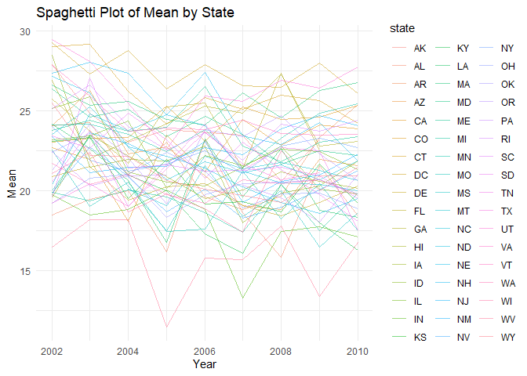
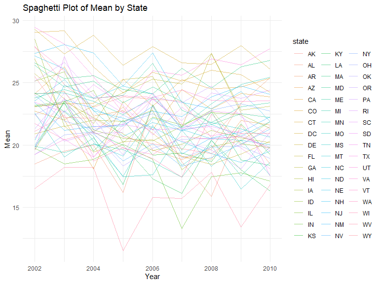
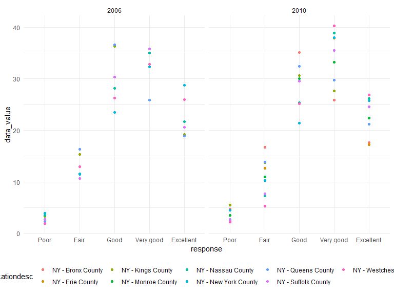
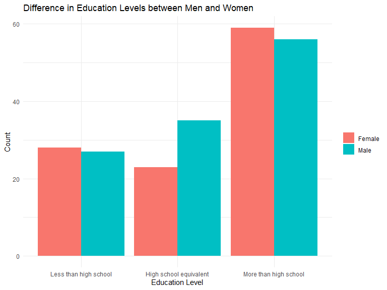
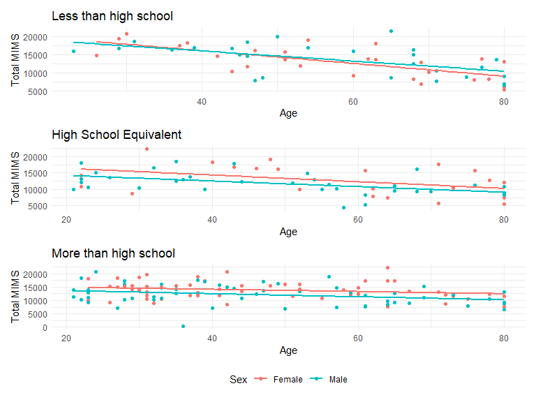
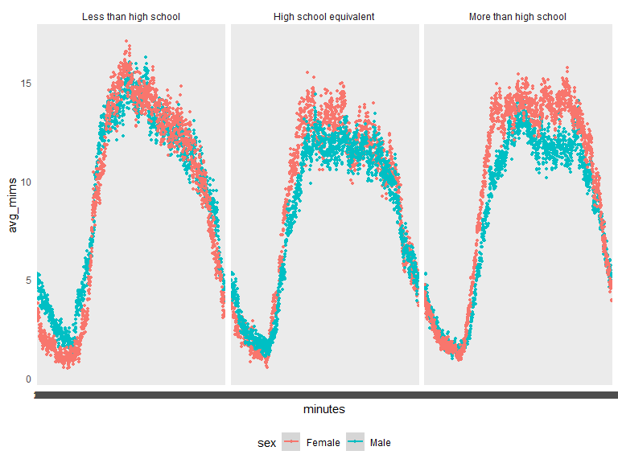

p8105_hw3_ajt2206
================
Andy Turner
2023-10-06

``` r
library(tidyverse)
```

    ## ── Attaching core tidyverse packages ──────────────────────── tidyverse 2.0.0 ──
    ## ✔ dplyr     1.1.2     ✔ readr     2.1.4
    ## ✔ forcats   1.0.0     ✔ stringr   1.5.0
    ## ✔ ggplot2   3.4.2     ✔ tibble    3.2.1
    ## ✔ lubridate 1.9.2     ✔ tidyr     1.3.0
    ## ✔ purrr     1.0.1     
    ## ── Conflicts ────────────────────────────────────────── tidyverse_conflicts() ──
    ## ✖ dplyr::filter() masks stats::filter()
    ## ✖ dplyr::lag()    masks stats::lag()
    ## ℹ Use the conflicted package (<http://conflicted.r-lib.org/>) to force all conflicts to become errors

``` r
library(p8105.datasets)
library(ggplot2)
library(patchwork)

knitr::opts_chunk$set(
    echo = TRUE,
    warning = FALSE,
    fig.width = 8, 
  fig.height = 6,
  out.width = "90%"
)

theme_set(theme_minimal() + theme(legend.position = "bottom"))

options(
  ggplot2.continuous.colour = "viridis",
  ggplot2.continuous.fill = "viridis"
)
```

## Problem 1:

**Loading data from library**

``` r
data("instacart")
```

**Description of dataset and illustrative example** The Instacart
dataset is an anonymized dataset from 2017 which details over 3 milion
online grocery orders from more than 200,000 Instacart Users. Despite
its large scale, the dataset still represents a random sample of the
overall Instacart user base. There are 1384617 observations, each
representing an order, and 15 variables in the dataset. The data is
currently in horizontal form. Some of the key variables to note are:

- `order_id`: order identifier
- `product_id`: product identifier
- `user_id`: customer identifier
- `product_name`: name of the product ordered
- `order_number`: the order sequence number for this user (1=first,
  n=nth)
- `days_since_prior_order`: days since the last order, capped 30, NA if
  `order_number`=1

For example, Observation 58 describes the 26th item added to the
Instacart order (`add_to_cart_order`= 26) by user 56463
(`user_id`=56463). This is the 41st order by the user
(`order_number=41`). Their prior order was 14 days/2 weeks prior
(`days_since_prior_order`=14. The specific item ordered
(`product_id`=47333) was Queso Fresco (`product_name`= “Queso Fresco”)
found in the specialty cheese aisle (`aisle`= “specialty cheese”) within
the dairy eggs department (`department`= “dairy eggs”). The user has
ordered this item in the past (`reordered=1`)

Below is a table summarizing the number of items ordered from aisle. In
total, there are 134 aisles, with fresh vegetables and fresh fruits
holding the most items ordered by far.

``` r
instacart |> 
  count(aisle) |> 
  arrange(desc(n))
```

    ## # A tibble: 134 × 2
    ##    aisle                              n
    ##    <chr>                          <int>
    ##  1 fresh vegetables              150609
    ##  2 fresh fruits                  150473
    ##  3 packaged vegetables fruits     78493
    ##  4 yogurt                         55240
    ##  5 packaged cheese                41699
    ##  6 water seltzer sparkling water  36617
    ##  7 milk                           32644
    ##  8 chips pretzels                 31269
    ##  9 soy lactosefree                26240
    ## 10 bread                          23635
    ## # ℹ 124 more rows

Next is a plot that shows the number of items ordered in each aisle.
Here, aisles are ordered by ascending number of items.

``` r
instacart |> 
  count(aisle) |> 
  filter(n > 10000) |> 
  mutate(aisle = fct_reorder(aisle, n)) |> 
  ggplot(aes(x = aisle, y = n)) + 
  geom_point() + 
  labs(title = "Number of items ordered in each aisle") +
  theme(axis.text.x = element_text(angle = 60, hjust = 1))
```



Our next table shows the three most popular items in aisles
`baking ingredients`, `dog food care`, and `packaged vegetables fruits`,
and includes the number of times each item is ordered in your table.

``` r
instacart |> 
  filter(aisle %in% c("baking ingredients", "dog food care", "packaged vegetables fruits")) |>
  group_by(aisle) |> 
  count(product_name) |> 
  mutate(rank = min_rank(desc(n))) |> 
  filter(rank < 4) |> 
  arrange(desc(n)) |>
  knitr::kable()
```

| aisle                      | product_name                                  |    n | rank |
|:---------------------------|:----------------------------------------------|-----:|-----:|
| packaged vegetables fruits | Organic Baby Spinach                          | 9784 |    1 |
| packaged vegetables fruits | Organic Raspberries                           | 5546 |    2 |
| packaged vegetables fruits | Organic Blueberries                           | 4966 |    3 |
| baking ingredients         | Light Brown Sugar                             |  499 |    1 |
| baking ingredients         | Pure Baking Soda                              |  387 |    2 |
| baking ingredients         | Cane Sugar                                    |  336 |    3 |
| dog food care              | Snack Sticks Chicken & Rice Recipe Dog Treats |   30 |    1 |
| dog food care              | Organix Chicken & Brown Rice Recipe           |   28 |    2 |
| dog food care              | Small Dog Biscuits                            |   26 |    3 |

Finally is a table showing the mean hour of the day at which Pink Lady
Apples and Coffee Ice Cream are ordered on each day of the week. This
table has been formatted in an untidy manner for human readers. Pink
Lady Apples are generally purchased slightly earlier in the day than
Coffee Ice Cream, with the exception of day 5.

``` r
instacart |>
  filter(product_name %in% c("Pink Lady Apples", "Coffee Ice Cream")) |>
  group_by(product_name, order_dow) |>
  summarize(mean_hour = mean(order_hour_of_day)) |>
  pivot_wider(
    names_from = order_dow, 
    values_from = mean_hour) |>
  knitr::kable(digits = 2)
```

    ## `summarise()` has grouped output by 'product_name'. You can override using the
    ## `.groups` argument.

| product_name     |     0 |     1 |     2 |     3 |     4 |     5 |     6 |
|:-----------------|------:|------:|------:|------:|------:|------:|------:|
| Coffee Ice Cream | 13.77 | 14.32 | 15.38 | 15.32 | 15.22 | 12.26 | 13.83 |
| Pink Lady Apples | 13.44 | 11.36 | 11.70 | 14.25 | 11.55 | 12.78 | 11.94 |

## Problem 2

**Loading the BRFSS data from our p8105 library.**

``` r
data("brfss_smart2010")

brfss=
  brfss_smart2010|> 
  janitor::clean_names() |> 
  rename(state = locationabbr) |> 
  filter(topic== "Overall Health") |> 
  mutate(response= factor(response, levels = c("Poor", "Fair", "Good", "Very good", "Excellent"))) |> 
  arrange(response)
```

**Data Import Cleaning Steps**

I imported the data directly into R from the p8105.datasets library
which we already loaded for Question 1. Afterwards, I used the
`janitor::clean_names()` to make all the variable names lower cased and
replace any spaces with `_`. I renamed the locationabbr variable to
state. Additionally, I filtered the dataset to only include observations
where the topic was “Overall Health.” Lastly, I converted the response
data from character to factor using the `factor()` function in R. I also
arranged the dataset using `arrange` by the response variable with the
recently ordered factor.

**Multiple location states**

``` r
brfss |> 
  filter(year == "2002" | year== "2010") |> 
  group_by(year, state) |> 
  summarize(locations=n_distinct(locationdesc)) |> 
   filter(locations>=7)
```

    ## `summarise()` has grouped output by 'year'. You can override using the
    ## `.groups` argument.

    ## # A tibble: 20 × 3
    ## # Groups:   year [2]
    ##     year state locations
    ##    <int> <chr>     <int>
    ##  1  2002 CT            7
    ##  2  2002 FL            7
    ##  3  2002 MA            8
    ##  4  2002 NC            7
    ##  5  2002 NJ            8
    ##  6  2002 PA           10
    ##  7  2010 CA           12
    ##  8  2010 CO            7
    ##  9  2010 FL           41
    ## 10  2010 MA            9
    ## 11  2010 MD           12
    ## 12  2010 NC           12
    ## 13  2010 NE           10
    ## 14  2010 NJ           19
    ## 15  2010 NY            9
    ## 16  2010 OH            8
    ## 17  2010 PA            7
    ## 18  2010 SC            7
    ## 19  2010 TX           16
    ## 20  2010 WA           10

To understand which states had 7 or more locations observed in 2002 and
2010 in the data, I filtered the dataset to only include years 2002 and
2010. I then grouped the data by year and state. Next, I summarized the
data to create a column n which pulled how many unique locations were in
each state per year. Lastly, I filtered to only states which had
location \>=7.

In 2002: There were 6 states which were observed at 7 or more locations.
CT, FL, MA, NC, NJ, and PA.

In 2010: There were 14 states which were observed at 7 or more
locations. CA, CO, FL, MA, MD, NC, NE, NJ, NY, OH, PA, SC, TX, WA.

**Excellent Dataset and Spaghetti Plot**

``` r
excellent_df=
  brfss |> 
  filter(response== "Excellent") |> 
  group_by(year, state) |> 
  mutate(mean_datavalue= mean(data_value)) |> 
  select (year, state, mean_datavalue) |> 
  distinct(year, state, mean_datavalue, .keep_all = TRUE)

ggplot(excellent_df, aes(x= year, y= mean_datavalue, group=state, color=state))+
  geom_line(alpha=0.5)+
  labs(
    title = "Spaghetti Plot of Mean by State",
    x = "Year",
    y = "Mean"
  ) +
  theme_minimal()
```



To construct the excellent dataset, I filtered brfss to only include
values of “Excellent” for the response variable. I grouped the data by
both year and state which allowed me to use the mutate function to
create a new variable “mean_datavalue” which was the average of the
data_value for each state separated by year. Afterwards, I used the
`select()` function to select only the variables year, state, and
mean_datavalue. Last, I used the `distinct()` function to only keep
unique rows.

To make a “spaghetti” plot, I used `ggplot` specifying year on my
x-axis, mean_datavalue on the y-axis, grouped by state and with each
state as a different color. Moreover, I used `geom_line` to specify that
I wanted a line graph. Other than that I used a few more functions to
improve the aesthetics of the graph such as adding a title via the
`labs()` function.

**Two-panel plot of data_value**

``` r
brfss |> 
  filter(year %in% c("2006", "2010"), state== "NY") |> 
  ggplot(aes(x=response, y=data_value, color=locationdesc))+
  geom_point(alpha=3.0)+
  facet_grid(. ~year)
```



To create a two-panel plot, I first loaded the patchwork library using
`library()`. Next, I worked to create the plot for 2006. I filtered the
brfss dataframe to only include year as 2006 and state as NY. Next, I
used `ggplot` specifying that I want response as my x-value, data-value
as my y value, and to color the points by locationdesc. Lastly, I used
`geom_point`to tell R to make a scatterplot. I did the same steps for
the 2010 plot except, I filtered for 2010. Last, to show the two plots
side by side, I just wrote dv_2006+dv_2010\`\` (graph_1 + graph_2) which
using patchwork puts the two graphs next to each other! Make a two-panel
plot showing, for the years 2006, and 2010, distribution of data_value
for responses (“Poor” to “Excellent”) among locations in NY State.

## Problem 3

**Data Import and Initial Manip**

``` r
demo_df=
  read_csv("data/nhanes_covar.csv", 
    skip = 4, na = ".")|> 
  janitor::clean_names() |> 
  filter(age >= "21", bmi != "NA") |> 
  mutate(
    sex= case_match(
      sex,
      1 ~ "Male",
      2 ~ "Female"),
    education=recode(
      education,
      "1" = "Less than high school",
      "2" = "High school equivalent",
      "3" = "More than high school"), 
    education= factor(education, levels = c("Less than high school", "High school equivalent", "More than high school"))
  )
```

    ## Rows: 250 Columns: 5
    ## ── Column specification ────────────────────────────────────────────────────────
    ## Delimiter: ","
    ## chr (2): BMI, education
    ## dbl (3): SEQN, sex, age
    ## 
    ## ℹ Use `spec()` to retrieve the full column specification for this data.
    ## ℹ Specify the column types or set `show_col_types = FALSE` to quiet this message.

``` r
accel_df=
  read_csv("data/nhanes_accel.csv") |> 
  janitor::clean_names() |> 
  pivot_longer(
    min1:min1440,
    names_to = "minutes",
    values_to = "mims",
    names_prefix= "min"
  ) |> 
  mutate(mims= as.numeric(mims),
         minutes= factor(minutes, levels = c(1:1440)))
```

    ## Rows: 250 Columns: 1441
    ## ── Column specification ────────────────────────────────────────────────────────
    ## Delimiter: ","
    ## dbl (1441): SEQN, min1, min2, min3, min4, min5, min6, min7, min8, min9, min1...
    ## 
    ## ℹ Use `spec()` to retrieve the full column specification for this data.
    ## ℹ Specify the column types or set `show_col_types = FALSE` to quiet this message.

``` r
mims_combined_df=
  left_join(demo_df, accel_df, by= "seqn")
```

**Data Import and Manipulation Description**

I used `readxl()` to read in the nhanes_covar excel file into R and
restricting only the range of cells I wanted. `janitor::clean_names()`
to clean up imported variable names. I filtered the data to only include
participants older than 21 and without NA values (for this data, the
only data with NA once filtered on 21 and up was in the BMI). I updated
sex and education to make the responses more easily identifiable. And I
updated education to be a factor level variable using `factor()` within
an overall `mutate()` function.

Import process for nhanes_accel was similar. I used `readxl()` to read
in the nhanes_accel excel file into R and restricting only the range of
cells I wanted. `janitor::clean_names()` to clean up imported variable
names. I used pivot longer to transform the data from horizontal to
vertical changing the variables min1:min1440 to become values within a
larger minute variable and then taking their values into a mim variable.
Additionally, I removed the prefixes from the value names for minute
(ex: min1 became 1). And I updated minutes to be a factor level variable
using `factor()` within an overall `mutate()` function.

To merge the two dataset, I used left-join which insured that only
individuals with demographic data would be included. seqn was used as
the variable to merge the data.

**Number of Men and Women in each Education Category Table &
Visualization**

``` r
demo_df |> 
  group_by(sex, education) |> 
  summarize(n_obs=n()) |> 
  pivot_wider(
    names_from= education,
    values_from= n_obs
  )
```

    ## `summarise()` has grouped output by 'sex'. You can override using the `.groups`
    ## argument.

    ## # A tibble: 2 × 4
    ## # Groups:   sex [2]
    ##   sex    `Less than high school` `High school equivalent` More than high schoo…¹
    ##   <chr>                    <int>                    <int>                  <int>
    ## 1 Female                      28                       23                     59
    ## 2 Male                        27                       35                     56
    ## # ℹ abbreviated name: ¹​`More than high school`

``` r
demo_df |> 
  group_by(sex, education) |> 
  summarize(n_obs=n()) |> 
  ggplot(aes(x= education, y= n_obs, fill= sex))+
  geom_bar(stat = "identity", position = "dodge")+
  labs(title = "Difference in Education Levels between Men and Women",
       x = "Education Level",
       y = "Count") +
  theme_minimal() +
  theme(legend.title = element_blank())
```

    ## `summarise()` has grouped output by 'sex'. You can override using the `.groups`
    ## argument.



Process: To create an easily readable table of the number of men and
women by education category, I grouped the data by sex and education and
used the `summarize()` function to create a create a count of each .
Last, I switched the data to wide view using `pivot_wider` to make it
more readable.

To visualize the data, I used the same grouping and summary, and then
used the `ggplot` function with education on the axis, the number of
observations on the y-axis, and fill as sex. I decided to use a bar
graph which I made using `geom_bar()`. Afterwards, just some slight
formatting and theme functions.

Comments: More women than men had less than high school and more than
high school education; however, they were at relatively similar levels.
There was a far greater gap in the high school equivalent level where
men outpaced women. Important to note that there are more men in the
sample overall (n=118 vs. n=110). Both men and women alike had More than
high school as the most common education level.

**Total MIMS by Age segemented by Education Level**

``` r
mims_combined_df =
  mims_combined_df |> 
  group_by(seqn) |> 
  mutate(total_mims= sum(mims))


less_hs =
  mims_combined_df |> 
  filter(education == "Less than high school") |> 
  ggplot(aes(x = age, y = total_mims, color = sex)) +
  geom_point()+
  geom_smooth(method = "lm", se = FALSE)+
  theme(legend.position= "none")+
  labs(title = "Less than high school",
       x = "Age",
       y = "Total MIMS",
       color = "Sex")

exact_hs =
  mims_combined_df |> 
  filter(education == "High school equivalent") |> 
  ggplot(aes(x = age, y = total_mims, color = sex)) +
  geom_point()+
  geom_smooth(method = "lm", se = FALSE)+
  theme(legend.position= "none")+
   labs(title = "High School Equivalent",
       x = "Age",
       y = "Total MIMS",
       color = "Sex")

more_hs =
  mims_combined_df |> 
  filter(education == "More than high school") |> 
  ggplot(aes(x = age, y = total_mims, color = sex)) +
  geom_point()+
  geom_smooth(method = "lm", se = FALSE)+
  theme(legend.position= "bottom")+
   labs(title = "More than high school",
       x = "Age",
       y = "Total MIMS",
       color = "Sex")
  
less_hs / exact_hs / more_hs
```

    ## `geom_smooth()` using formula = 'y ~ x'
    ## `geom_smooth()` using formula = 'y ~ x'
    ## `geom_smooth()` using formula = 'y ~ x'



**Description of patterns on graph** Across education levels, younger
people had higher levels of total MIMS than older populations. However,
the level of decrease in total MIMS differed by level. Less than high
school say the greatest difference in MIMS by age whereas More than high
school saw the least. Women had higher total MIMs activity across all
ages within the High school equivalent and more than high school
education levels. However, within the Less than high school group, women
below 45 had higher MIMS, but women above 45 had lower levels than men.

**MIMS throghout the day**

``` r
mims_combined_df |> 
  group_by(minutes, education, sex) |> 
  mutate(avg_mims= mean(mims)) |> 
  ggplot(aes(x=minutes, y=avg_mims, color=sex)) +
  geom_point(size= 1.0)+
  geom_smooth()+
  facet_grid(. ~education)
```

    ## `geom_smooth()` using method = 'loess' and formula = 'y ~ x'



**Patterns in the data** Based on the graph, we can see that MIMS are
lowest in the early morning and increase throughout the day until
plateuing through the afternoon before once again decreasing in the
night. We see that women appear to have lower values of MIMS in the late
night and early morning, but generally have higher values throughout
other parts of the day.
